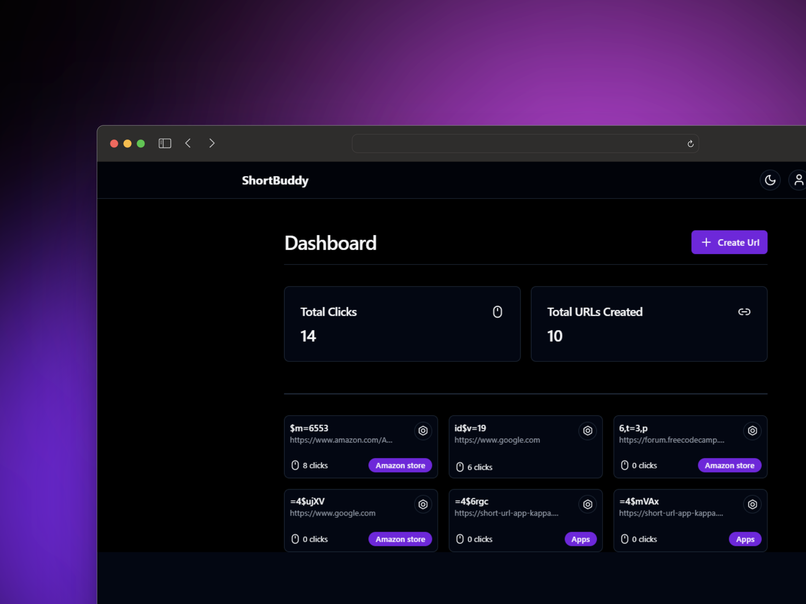

# ShortBuddy - Acorta tus URLs fácilmente

**ShortBuddy** es una aplicación web que permite a los usuarios acortar sus URLs largas de una manera rápida y sencilla.




## 🚀 Características Principales

- **Acortar URLs largas**: Transforma tus enlaces extensos en versiones cortas y manejables.
- **Autenticación de usuarios**: Registra y accede a tu cuenta para un manejo seguro de tus URLs.
- **Estadísticas**: Obtén datos detallados sobre el uso de tus URLs acortadas.
- **Grupos de URLs**: Organiza tus enlaces en grupos para una mejor gestión.
- **Dashboard personalizado**: Un panel de control para gestionar tus URLs de manera eficiente.

## 🛠️ Tecnologías Utilizadas

- Next.js: El framework de React para producción.
- Tailwind CSS: Un framework CSS para un diseño rápido y responsivo.
- Prisma: ORM de próxima generación para Node.js y TypeScript.
- Supabase: Backend como servicio para acelerar el desarrollo.
- Shadcn/ui: Componentes de UI reutilizables para React.
- React Hook Form: Biblioteca para formularios en React.
- Lucide Icons: Iconos cuidadosamente diseñados para tus proyectos.

## 📦 Instalación

1. Clona el repositorio:

```bash
git clone
```

2. Instala las dependencias:

```bash
npm install
```

3. Crea un archivo `.env.local` en la raíz del proyecto y añade las siguientes variables de entorno:

```bash
DATABASE_URL=""
DIRECT_URL=""
AUTH_SECRET=""
```

Las variables `DATABASE_URL`, `DIRECT_URL` y `AUTH_SECRET` son necesarias para la conexión a la base de datos y la autenticación de usuarios. Las cadenas de conexion se pueden obtener creando un proyecto en [Supabase](https://supabase.io/).

4. Inicia el servidor de desarrollo:

```bash
npm run dev
```

5. Abre [http://localhost:3000](http://localhost:3000) en tu navegador.
